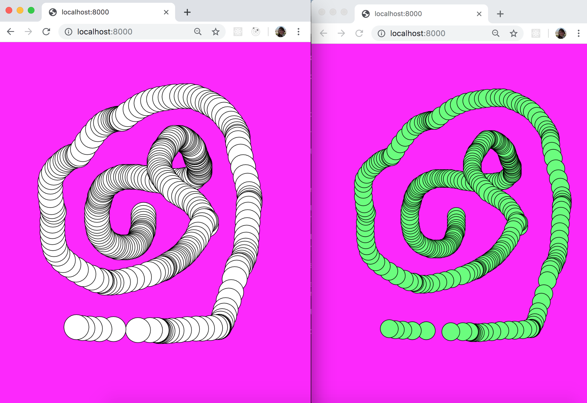

# IAT884 Socket Server example

Simple example of using server using socket.io to transmit data from one browser window to another. If you click and drag your mouse to draw on one screen, it will draw circles on the other.

Working example is live here: https://secure-sierra-92770.herokuapp.com/

Based off the example from the Coding Rainbow https://www.youtube.com/watch?v=bjULmG8fqc8
 

## To install locally

To run locally you will need node.js installed https://nodejs.org/

From the terminal:

Run the following command to download the repository
`git clone https://github.com/emclaren/p5-node-server-socket-io-example.git` 

Enter into the newly downlaoded directory
`cd p5-node-server-socket-io-example/`

Use `npm install` to download the required packages

To start the server on port 8000 run:
`node server.js` 

The app will be running on http://localhost:8000/

Open two browser windows, and then click and drag your mouse to paint. 

